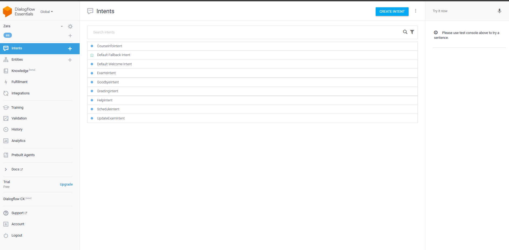
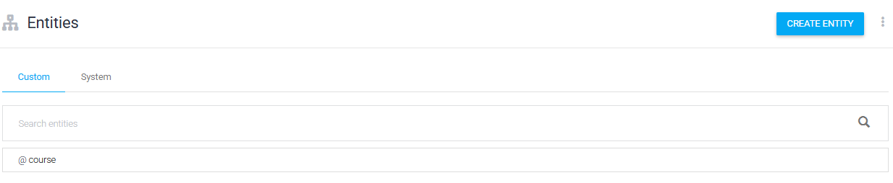
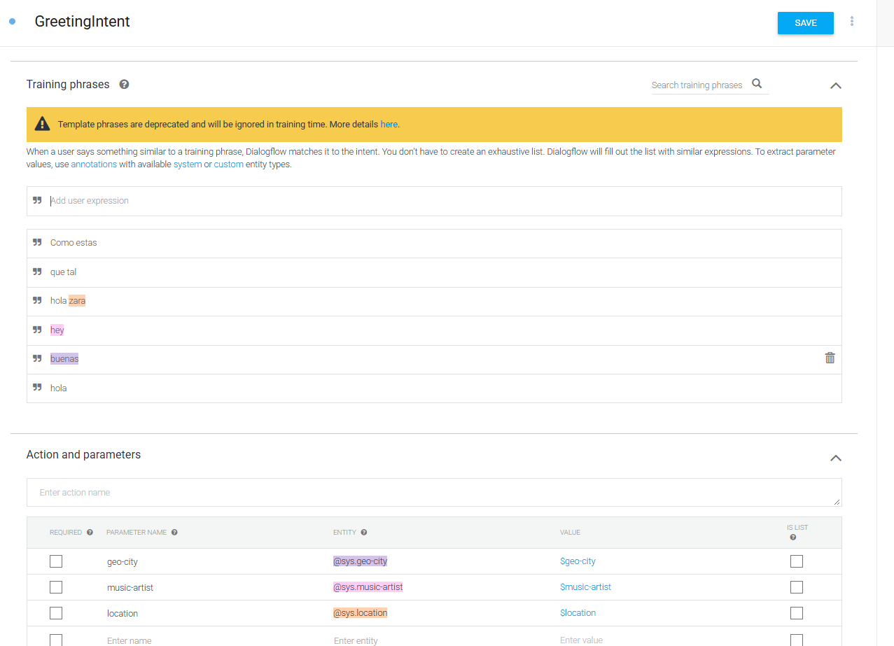
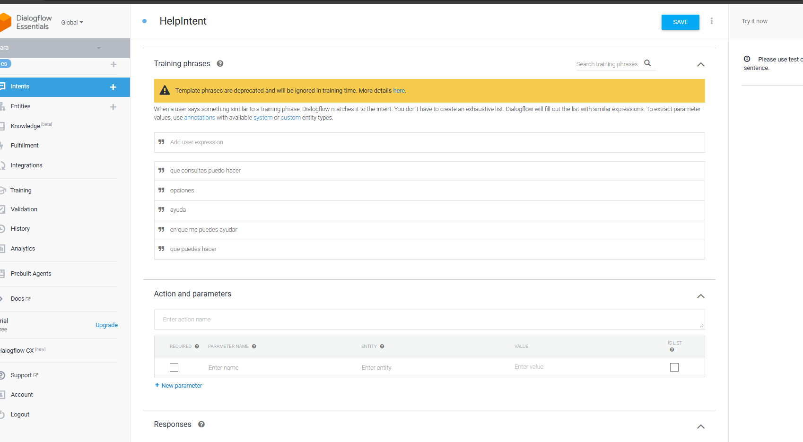
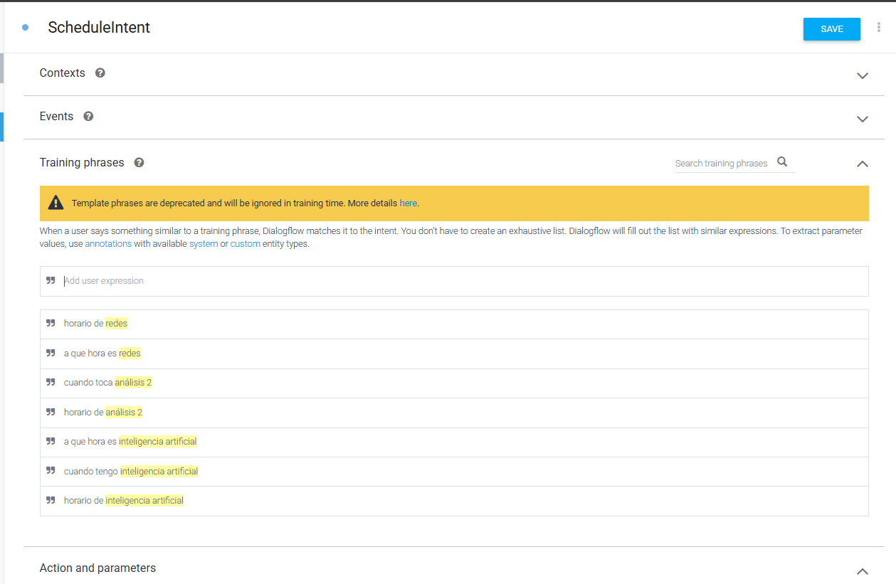
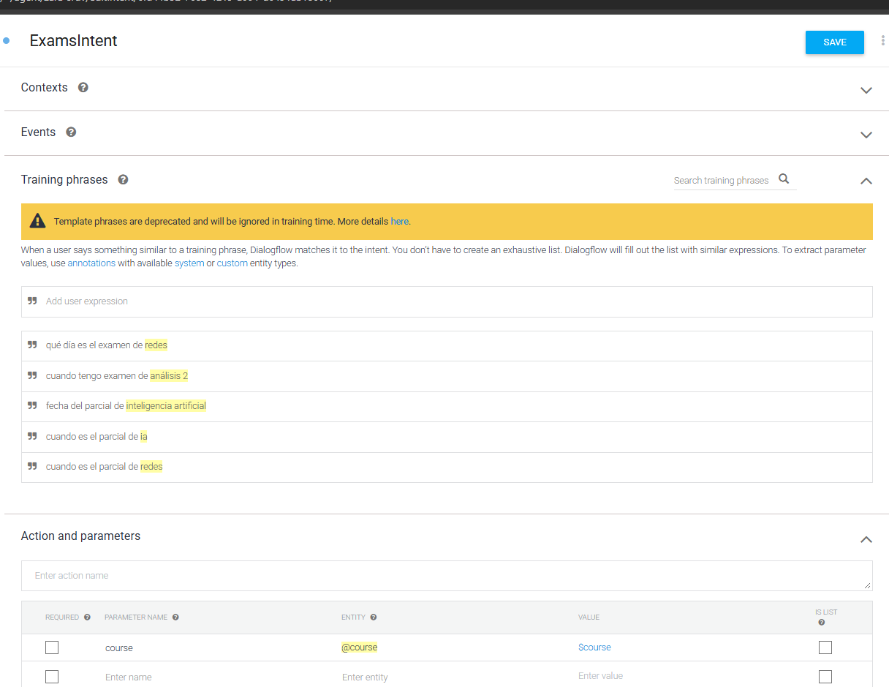
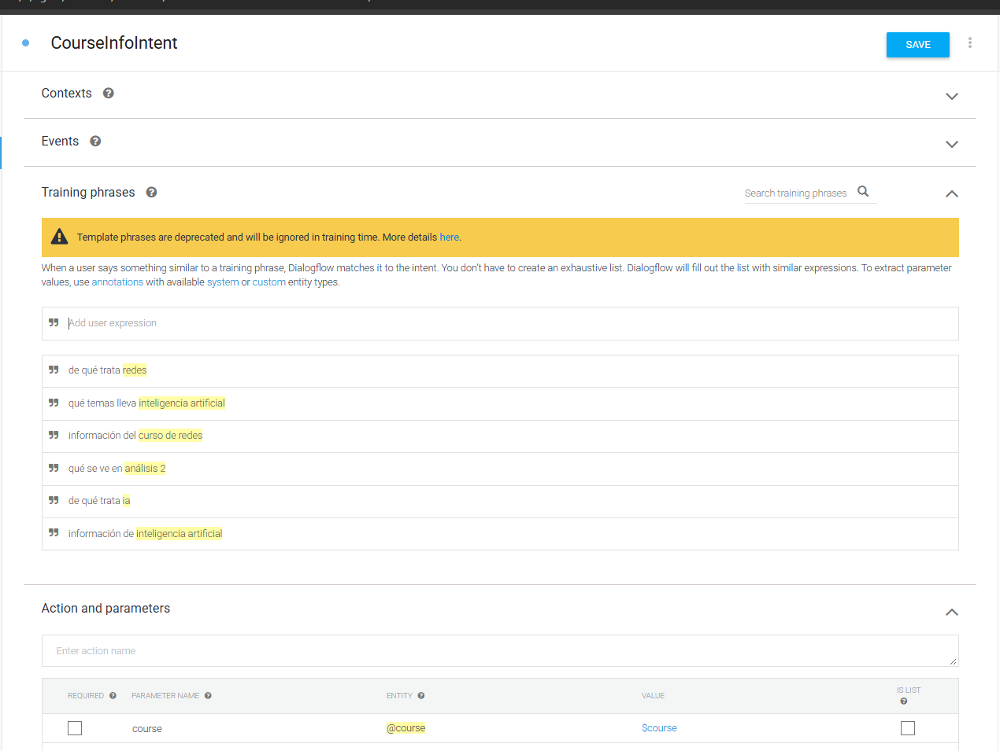
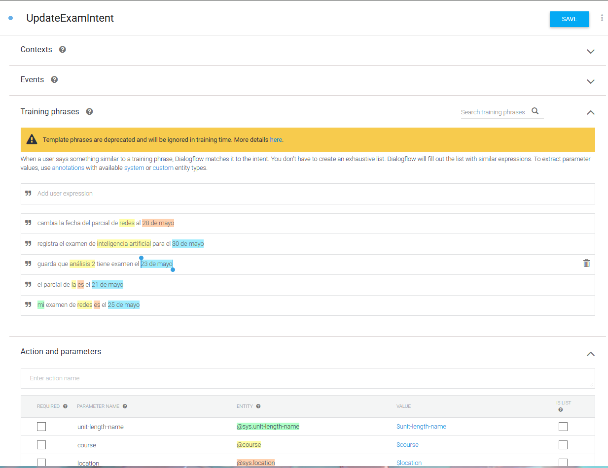
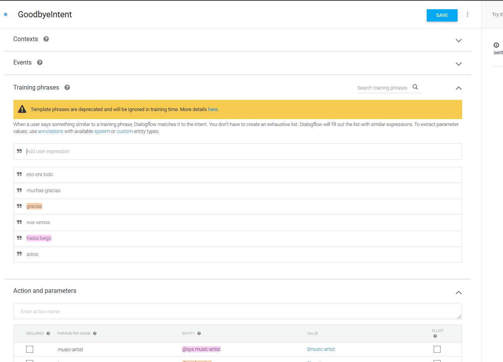

# Documentacion Tecnica de Zara

Zara es un webhook para Dialogflow orientado a consultas academicas. Dialogflow detecta la intencion del usuario, envia el request al endpoint `/webhook`, y FastAPI responde con `fulfillmentText`.

## Estructura Principal

```text
app/
  main.py
  data/
    courses.json
  services/
    course_service.py
ci/
  Jenkinsfile
  playbook/
    deploy.yml
    docker-compose.yml
docs/
  docs_screens/
```

## Flujo del Webhook

1. Dialogflow recibe un mensaje del usuario.
2. Dialogflow detecta una intencion, por ejemplo `ScheduleIntent` o `ExamsIntent`.
3. Dialogflow envia un JSON al endpoint `POST /webhook`.
4. `app/main.py` extrae:
   - `queryResult.intent.displayName`
   - `queryResult.parameters.course`
   - `queryResult.parameters.date`
5. `CourseService` busca o actualiza la informacion en `app/data/courses.json`.
6. FastAPI responde con `fulfillmentText`.

## Endpoints

### `GET /`

Devuelve un estado simple del servicio.

```json
{
  "status": "Zara webhook running"
}
```

### `GET /health`

Endpoint usado para verificar que el contenedor esta vivo.

```json
{
  "status": "ok"
}
```

### `POST /webhook`

Endpoint principal para fulfillment de Dialogflow.

## Intenciones Soportadas

| Intent | Funcion | Descripcion |
| --- | --- | --- |
| `ScheduleIntent` | `get_schedule` | Devuelve el horario de un curso. |
| `ExamsIntent` | `get_exam` | Devuelve la fecha registrada del parcial. |
| `CourseInfoIntent` | `get_info` | Devuelve temas principales del curso. |
| `UpdateExamIntent` | `update_exam` | Actualiza la fecha de parcial de un curso. |

Si llega una intencion no manejada por el webhook, la respuesta por defecto es:

```text
Puedo ayudarte con horarios, parciales e informacion de cursos.
```

## Datos de Cursos

Los datos viven en `app/data/courses.json`. Cada curso tiene:

- `name`: nombre visible del curso.
- `schedule`: horario.
- `exam`: fecha de parcial.
- `topics`: lista de temas.

Ejemplo:

```json
{
  "ia": {
    "name": "Inteligencia Artificial",
    "schedule": "Martes 6:10 PM",
    "exam": "21 de abril",
    "topics": ["agentes inteligentes", "busqueda", "machine learning"]
  }
}
```

## Normalizacion de Cursos

`CourseService.normalize()` permite reconocer aliases como:

- `inteligencia artificial`, `curso de ia`, `ia`
- `analisis 2`, `análisis 2`, `a2`
- `redes`, `redes 1`, `curso de redes`

Esto permite que el usuario escriba variaciones naturales y el backend consulte la misma llave interna.

## Despliegue

El despliegue usa:

- `ci/Jenkinsfile`: pipeline de Jenkins.
- `ci/playbook/deploy.yml`: playbook de Ansible.
- `ci/playbook/docker-compose.yml`: compose usado como archivo de despliegue.
- `Dockerfile`: imagen del webhook.

Jenkins recibe dos archivos como credenciales:

- `chatbot-env`: archivo `.env` de despliegue.
- `chatbot-docker-compose`: compose de despliegue.

El playbook sincroniza el proyecto al servidor, copia el `.env`, copia el compose y ejecuta Docker Compose.

## Capturas de Dialogflow

### Inicio del Agente



Esta captura muestra el agente Zara dentro de Dialogflow. Desde aqui se administran las intenciones, entidades, entrenamiento y configuracion general del bot.

### Entidad de Cursos



La entidad define los valores que Dialogflow puede extraer como parametro `course`. Esta configuracion ayuda a reconocer nombres de cursos y sus sinonimos antes de enviarlos al webhook.

### `GreetingsIntent`



Intencion para saludos iniciales. Sirve para que el bot responda de forma amigable cuando el usuario inicia una conversacion.

### `HelpIntent`



Intencion de ayuda. Presenta al usuario las acciones que puede pedirle al bot, como consultar horarios, fechas de parciales o informacion de cursos.

### `ScheduleIntent`



Intencion para consultar horarios. Dialogflow extrae el curso solicitado y el webhook responde usando `CourseService.get_schedule()`.

### `ExamIntent`



Intencion para consultar parciales. El webhook busca la fecha registrada del curso con `CourseService.get_exam()` y responde solo con la fecha limpia cuando Dialogflow envia valores tipo timestamp.

### `CourseInfoIntent`



Intencion para pedir informacion general de un curso. El backend responde con los temas registrados en `courses.json`.

### `UpdateExamIntent`



Intencion para actualizar la fecha de parcial. Dialogflow envia `course` y `date`; el webhook actualiza el archivo `courses.json` mediante `CourseService.update_exam()`.

### `GoodByeIntent`



Intencion de despedida. Cierra la conversacion de manera natural cuando el usuario termina la interaccion.
